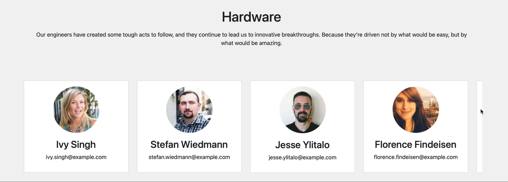

**SandPit Assigment**
# Martin Reinoso

# About-Us Web Page

| Name | Date | State |
| :---         |     :---:      |          ---: |
| Martin Reinoso  | 21/02/2021     |  Done |

## Table of contents
* [Overview](#Overview)
* [PHP](#PHP)
* [HTML/JS/CSS](#HTML/JS/CSS)
* [UX](#UX)

## Overview

This document explains and give examples behind the development and use of the About-Us section on the webpage. The website uses [Bootstrap](https://getbootstrap.com)to manage multiple display-Sizes and mobile devices.

All the code, except from one function was written by me since last Friday (aprox 16 hours of work). The function not written by me is a helper in the `script.js` with the acknowledgment.

Clone this repo in your LAMP style server running PHP 7.3

The website can be accessed by pointing to the root URL in the folder with the code or visiting`http://localhost/[your path]/about-us`

It includes a php component to access https://randomuser.me/ and download to the server profiles of users. You might need to give permissons to the file `Model/data` in your server to save the profiles.

I recomend to use 20 -> 30 -> 50 -> 100 Users to test de website. 

`http://localhost/[your_path]/update-data?totalStaff=[ number_of_profiles_to_download]`

Examples:

`http://localhost/[your_path]/update-data?totalStaff=20`

`http://localhost/[your_path]/update-data?totalStaff=30`

`http://localhost/[your_path]/update-data?totalStaff=50`

`http://localhost/[your_path]/update-data?totalStaff=100`

## PHP - System Architecture 

I have created the classes, `Department.php` that keep a name, description and an array of staff working under the deparment. The staff info is in the class `Person.php`, that keeps the name, photo and email.

The website is build using MVC. The files structure and filenames should be self explenatory.

The information is stored in the Model in the file `data`. This should be replaced with a Data base in the future.

The view has the php for the `about-us` page and the JavaScript and css files.

## HTML/JS/CSS

The code uses simple CSS and HTML, most of the functionality is in `script.js`

## UX

The idea is to have a clean interface that is fast and can be scalabel to include more profiles.
All Departments of the company at load at the start, but only 5 Contacs are loaded.

An scroll animation is used to show the user that there are more cards in this Department.

  

When the user scroll the initial 5 cards, more card are requested to the server. Every time the server returns 5 cards. An animation shows that more cards are available.

  

When the Click a Card it scrolls it.

  

